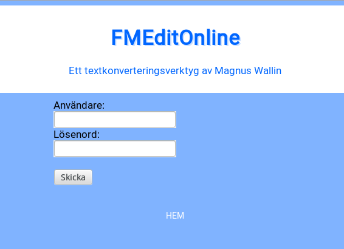

# FMEditOnline

A simple text modifier for `.tab` files exported from FileMaker Pro

Not for general usage since the text and fields from the database depend on **how** the database is configured.
In other words, this application is highly specialized and written for a single purpose for a single company!

Nevertheless, the license is as below.

# License

    FMEditOnline. A simple text modifier for '.tab' files exported from FileMaker Pro
    Copyright (C) 2016  Magnus Wallin

    This program is free software: you can redistribute it and/or modify
    it under the terms of the GNU General Public License as published by
    the Free Software Foundation, either version 3 of the License, or
    (at your option) any later version.

    This program is distributed in the hope that it will be useful,
    but WITHOUT ANY WARRANTY; without even the implied warranty of
    MERCHANTABILITY or FITNESS FOR A PARTICULAR PURPOSE.  See the
    GNU General Public License for more details.

    You should have received a copy of the GNU General Public License
    along with this program.  If not, see <http://www.gnu.org/licenses/>.

--

Some screenshots

